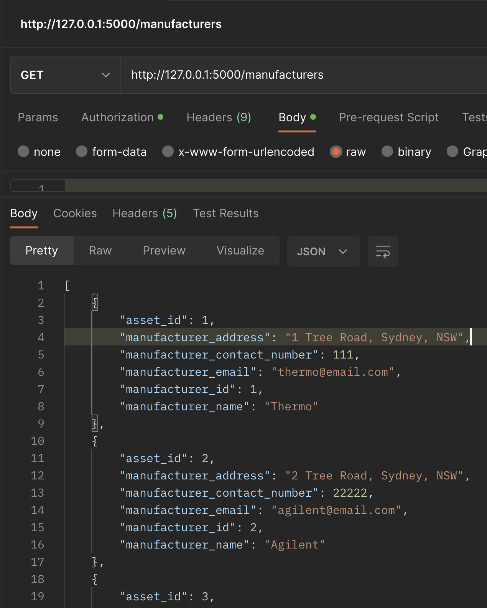

# *Lab Asset Management API*

## *Installation*

### Requirements
Have PostgreSQL installed

### 1. create and active a vitual environment
```virtualenv venv && source venv/bin/activate```

### 2. Installing dependencies
```pip install -r ./src/requirements.txt```

### 3. Create database
```flask db create```

### 4. Seed database - using data already provided
```flask db seed```

### 5. Drop database - remove data and tables
```flask db drop```

## *Why was this created?*
I came accross this problem in real life where I was helping a customer in relocating some of there labratory instruments from one site to a newly built site. Ths customer is a massive organisation that has many instruments, employees and departments and had trouble in identifying:
* what instuments each department have
* who the main contact for the instrument is
* who the manufacturer of the instrument is
* what the serial number of the instrument is 
* what type is instrument (could other manufacturers relocate) 
* when was the last PM/qualification for the instrument - will a service need to be done when relocated

They were dealing with over 600 manfacturers (Internationally and locally) and spent over a year trying to get this data. The API I have created (even though on a simplier scale) was designed to address and rectify all these issues in indentifying where lab instruments could belong. 

## *Why is this important?*
Lab asset management is really important for many reasons. The API created would identify and address these issues that the cutomer faced. These include:
* planning and forecasting - lab equipment is really expensive (some instruments are 2million plus) and if older equipment are no longer supported by manufacturers, these instruments need to be replaced eventually. Planning for a replacement to meet the required workflow could take up to a year and due to the heavy investments, planning is essential. In the assests model, a date of purchased has been included so the age of the instrument is known. This would essentially help plan for future replacements
* Compliance - Generally most labs have to be compliant with regulatory requirements and standards in the clinical, pharma and diagnostic markets. This could include annual PM's (Preventaive Maintenance) and qualifications to meet these standards. The API includes a service jobs model that includes a history of service jobs done on the instrument. A user would be able to track when the last PM or qualifiaction was done and be able to plan for te next one. 
* Risk Management - having a ideas of which instruments are most likely going to breakdown or have had a history of breaking down is important for a business. This will be able to be seen by the service job history of the instrument.
* Associating the lab instrument to a user/employee - This is important especially in a big organisation as there could be no accountabilty if instruments got lost or damaged. Having a employee associated to one asset mitigates this risk as they are responsible to manage it
  


## *Document all endpoints for your API*

### View all employees
'GET' - ```@employees.route("/", methods=["GET"])```
* Example - http://127.0.0.1:5000/employees
* Authentication method - any USER
* Expected Response: 


### View all assets
'GET' - ```@assets.route("/", methods=["GET"])```
* Example - http://127.0.0.1:5000/assets
* Authentication method - any USER
* Expected Response: 


### View all manufacturers
'GET' - ```@manufacturers.route("/", methods=["GET"])```
* Example - http://127.0.0.1:5000/manufacturers
* Authentication method - any USER
* Expected Response: 


### View all departments
'GET' - ```@departments.route("/", methods=["GET"])```
* Example - http://127.0.0.1:5000/departments
* Authentication method - any USER
* Expected Response: 


### View all service jobs
'GET' - ```@service_job.route("/", methods=["GET"])```
* Example - http://127.0.0.1:5000/service_job
* Authentication method - any USER
* Expected Response: 


### View all assets in a department
'GET' - ```@departments.route('/assets/<int:department_id>', methods=["GET"])```
* Example - http://127.0.0.1:5000/departments/assets/1
* Authentication method - any USER
* Expected Response: 


### View assets a employee have
'GET' - ```@employees.route('/assets/<int:employee_id>', methods=["GET"])```
* Example - http://127.0.0.1:5000/employees/assets/1
* Authentication method - any USER
* Expected Response: 


### View all service jobs for the asset
'GET' - ```@assets.route('/service_job/<int:asset_id>', methods=["GET"])```
* Example - http://127.0.0.1:5000/assets/service_job/1
* Authentication method - any USER
* Expected Response: 


### View details of one asset
'GET' - ```@assets.route("/<int:id>/", methods=["GET"])```
* Example - http://127.0.0.1:5000/assets/1
* Authentication method - any USER
* Expected Response: 


### View details of one employee
'GET' - ```@employees.route("/<int:id>/", methods=["GET"])```
* Example - http://127.0.0.1:5000/employees/1
* Authentication method - any USER
* Expected Response: 


### View details of one department
'GET' - ```@departments.route("/<int:id>/", methods=["GET"])```
* Example - http://127.0.0.1:5000/departments/2
* Authentication method - any USER
* Expected Response: 


### View details of one manufacterer 
'GET' - ```@manufacturers.route("/<int:id>/", methods=["GET"]))```
* Example - http://127.0.0.1:5000/manufacturers/1
* Authentication method - any USER
* Expected Response: 


### View details of one sevice job
'GET' - ```@service_job.route("/<int:id>/", methods=["GET"])```
* Example - http://127.0.0.1:5000/manufacturers/1
* Authentication method - any USER
* Expected Response: 


### Delete employee
'DELETE' - ```@employees.route("/<int:id>/", methods=["DELETE"])```
* Example - http://127.0.0.1:5000/employees/1
* Authentication method - ADMIN
* Expected Response: 


### Delete asset
'DELETE' - ```@assets.route("/<int:id>/", methods=["DELETE"])```
* Example - http://127.0.0.1:5000/assets/1
* Authentication method - ADMIN
* Expected Response: 


### Delete department
'DELETE' - ```@departments.route("/<int:id>/", methods=["DELETE"])```
* Example - http://127.0.0.1:5000/departments/1
* Authentication method - ADMIN
* Expected Response: 


### Delete manufacturer 
'DELETE' - ```@manufacturers.route("/<int:id>/", methods=["DELETE"])```
* Example - http://127.0.0.1:5000/manufacturers/3
* Authentication method - ADMIN
* Expected Response: 


### Delete service job 
'DELETE' - ```@@service_job.route("/<int:id>/", methods=["DELETE"])```
* Example - http://127.0.0.1:5000/service_job/7
* Authentication method - ADMIN
* Expected Response: 
  

### Add department
'POST' - ```@departments.route("/", methods=["POST"])```
* Example - http://127.0.0.1:5000/departments/
* Authentication method - ADMIN
* Expected Response


### Add employee
'POST' - ```@employees.route("/", methods=["POST"])```
* Example - http://127.0.0.1:5000/employees/
* Authentication method - ADMIN
* Expected Response: 


### Add asset
'POST' - ```@assets.route("/", methods=["POST"])```
* Example - http://127.0.0.1:5000/assets/
* Authentication method - ADMIN
* Expected Response


### Add manufacturer
'POST' - ```@manufacturers.route("/", methods=["POST"])```
* Example - http://127.0.0.1:5000/manufacturers/
* Authentication method - ADMIN
* Expected Response


### Add service job
'POST' - ```@service_job.route("/", methods=["POST"])```
* Example - http://127.0.0.1:5000/service_jobs/
* Authentication method - ADMIN
* Expected Response


### Add user
'POST' - ```@auth.route("/register", methods=["POST"])```
* Example - http://127.0.0.1:5000/auth/register
* Authentication method - User
* Expected Response


### Login user
'POST' - ```@auth.route("/login", methods=["POST"])```
* Example - http://127.0.0.1:5000/auth/login
* Authentication method - User
* Expected Response


### Update department
'PUT' - ```@departments.route("/<int:id>/", methods=["PUT"])```
* Example - http://127.0.0.1:5000/departments/1
* Authentication method - ADMIN
* Expected Response


### Update employee
'PUT' - ```@employees.route("/<int:id>/", methods=["PUT"])```
* Example - http://127.0.0.1:5000/employees/1
* Authentication method - ADMIN
* Expected Response


### Update asset
'PUT' - ```@assets.route("/<int:id>/", methods=["PUT"])```
* Example - http://127.0.0.1:5000/assets/1
* Authentication method - ADMIN
* Expected Response


### Update manufacturer
'PUT' - ```@manufacturers.route("/<int:id>/", methods=["PUT"])```
* Example - http://127.0.0.1:5000/manufacturers/1
* Authentication method - ADMIN
* Expected Response


### Update service job
'PUT' - ```@service_job.route("/<int:id>/", methods=["PUT"])```
* Example - http://127.0.0.1:5000/service_job/1
* Authentication method - ADMIN
* Expected Response


  

